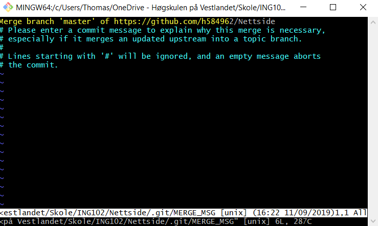

# Nettside

Dette er et sample prosjekt. Meningen er å forme hvordan prosjektet skal se ut.

Akkurat nå er velkomstsiden **index.html**.
Denne siden skal peke videre til alle sammen. Resten finner man i **personer/**__navn__**.html**


## Bruksanvisning:

```
git add .
git commit -m "Melding her"
git push
```


Forklaring:

```git add .``` legger til alle filene du har jobbet med og gjør de klar.  
```git commit -m "Melding her"``` pakker filene sammen i en versjon (siden git er for versjonskontroll)  
```git push``` sender pakkene til github.  

Dersom det kommer et forferdelig vindu som dette her:


Må du bare trykke ESC (Escape) og skrive :wq på bunnen.
Forklaring: Dette åpner noe som heter VIM som rett og slett bare er et forferdelig program.
For å ordne dette må man bare akseptere sammenslåingen. I praksis (for vår del) betyr det bare å lagre tekstfilen som den åpner.
