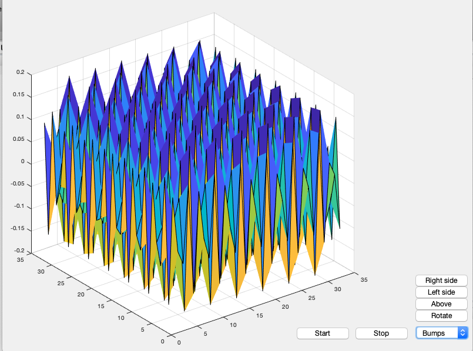
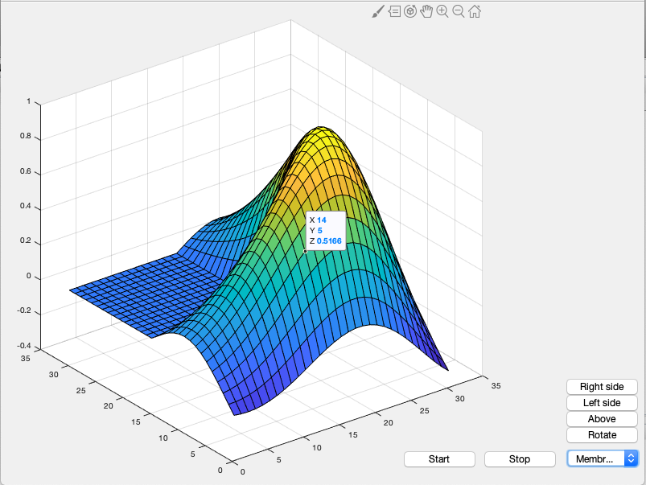
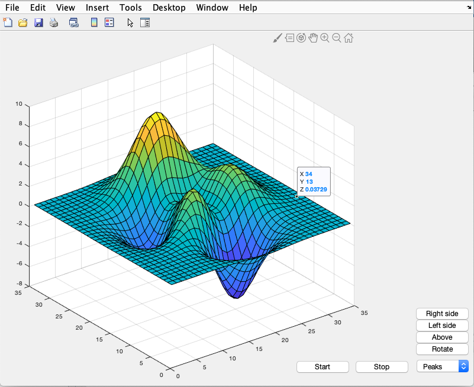
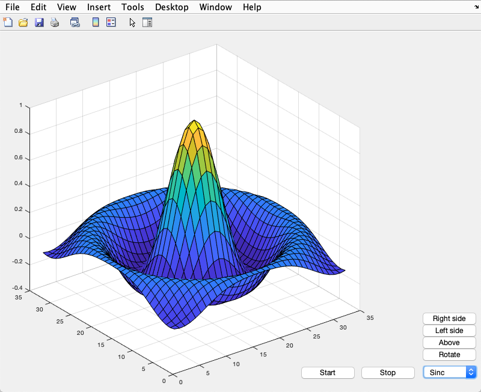
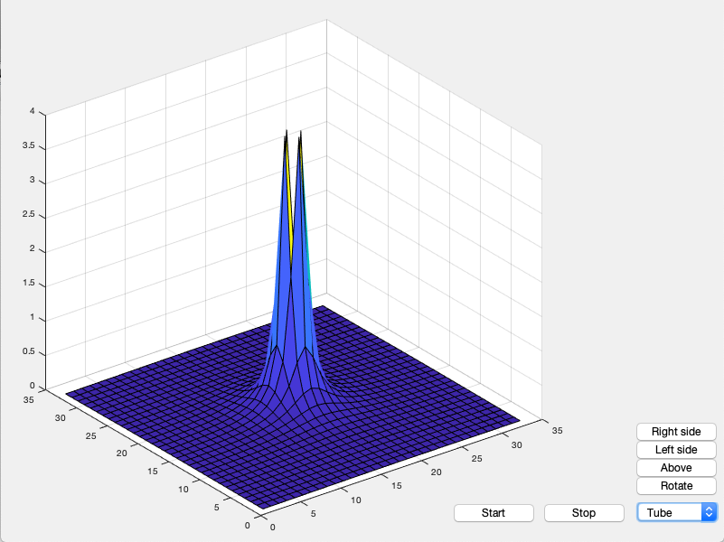

# Matlab
Vi har i tillegg til dette jobbet med matlab. I første runde tenker vi bare å vise frem hva vi kan få gjort med programmet. Et par skjermbilder av programmet når det kjører finnes under. I tillegg kan man også se på kildekoden, laste den ned, og endre på den hvis man vil. HTML generert via [Markdown](matlab.md) og verktøyet [Dillinger.io](https://dillinger.io/).

**Bumps**  

**Membrane**  

**Peaks Above**  

**Peaks Left**  

**Peaks Right**  

**Peaks Rotated**  

**Peaks**  

**Sinc**  

**Tube**  

```matlab
function simple_gui2
    % SIMPLE_GUI2 Select a data set from the pop-up menu and display
    f = figure('Position',[200,200,800,600]);

    h = [];

    % Construct the components.
    h(1) = uicontrol('Style','popupmenu',...
               'String',{'Peaks','Membrane','Sinc','Tube','Bumps'},...
               'Position',[700,20,100,25],...
               'Callback',@popup_menu_Callback);      

    h(2) = axes('Units','pixels','Position',[50,30,550,550]);
    
    h(3) = uicontrol('style', 'pushbutton',...
                    'string', 'Rotate', 'position', [702,50,93,25],...
                    'callback', @rotate_button_Callback);
                
    h(4) = uicontrol('style', 'pushbutton',...
                    'string', 'Above', 'position', [702,70,93,25],...
                    'callback', @above_button_Callback);
                
    h(5) = uicontrol('style', 'pushbutton',...
                    'string', 'Left side', 'position', [702,90,93,25],...
                    'callback', @lside_button_Callback);
                
    h(6) = uicontrol('style', 'pushbutton',...
                    'string', 'Right side', 'position', [702,110,93,25],...
                    'callback', @rside_button_Callback);
                
    h(7) = uicontrol('style', 'pushbutton',...
                    'string', 'Start', 'position', [500,20,93,25],...
                    'callback', @start_button_Callback);
    
    h(8) = uicontrol('style', 'pushbutton',...
                    'string', 'Stop', 'position', [600,20,93,25],...
                    'callback', @stop_button_Callback);
  
    % Assure resize automatically.
    f.Units = 'normalized';
    set(h, 'Units', 'normalized');
    set(h, 'FontSize', 12);

    % Generate the data to plot.
    peaks_data = peaks(35);
    membrane_data = membrane;
    [x,y] = meshgrid(-8:.5:8);
    r = sqrt(x.^2+y.^2) + eps;
    sinc_data = sin(r)./r;
    t = (x.^2 + y.^2);
    tube_data = 1./t;
    b = sin(5*x).*cos(5*y);
    bump_data = b./5;

    % Create a plot in the axes.
    current_data = peaks_data;
    v = surf(current_data);
    
    % Creating the timer
    tmr = timer('ExecutionMode', 'FixedRate', ... 
                'Period', 0.2, ...
                'TimerFcn',@timerCallback);
    
    % Added sound
    [y, Fs] = audioread('Lyd.mp3');
    player = audioplayer(y, Fs);


   %  Pop-up menu callback. Read the pop-up menu Value property to
   function popup_menu_Callback(source,eventdata) 
      % Determine the selected data set.
      str = get(source, 'String');
      val = get(source,'Value');
      % Set current data to the selected data set.
      switch str{val};
      case 'Peaks' % User selects Peaks.
         current_data = peaks_data;
      case 'Membrane' 
         current_data = membrane_data;
      case 'Sinc' 
         current_data = sinc_data; 
      case 'Tube'
          current_data = tube_data;
      case 'Bumps'
          current_data = bump_data;
      end    
      v = surf(current_data);
   end
   
   % Rotate button callback. 
   function rotate_button_Callback(source, event)
       direction = [0 0 1];
       rotate(v, direction, 5);
   end

   % Above button callback
    function above_button_Callback(source, event)
        v = surf(current_data);
        direction = [1 -1 0];
        rotate(v, direction, 90);
    end

    % Left side button callback
    function lside_button_Callback(source, event)
        v = surf(current_data);
        direction = [0 0 1];
        rotate(v, direction, 90);
    end
    % Right side button callback
    function rside_button_Callback(source, event)
        v = surf(current_data);
        direction = [0 0 1];
        rotate(v, direction, -90);
    end
    

    % Timer callback
    function timerCallback(hObj, eventdata)
        direction = [0,0,1];
        rotate(v,direction, 1);
    end

    
     
    % Right start button callback
    function start_button_Callback(source, event)
        start(tmr);
        play(player);
    end
    
    % Stop button callback    
    function stop_button_Callback(source, event)
        stop(tmr);
        stop(player);
    end
end
```